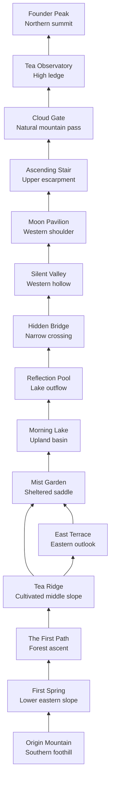

# QING YUN JIAN ASCEND Universe

## Phase 2: Official Geography v1.0

> **Canon status:** This document is the approved geography working record. The authoritative single source of truth is now [The ASCEND Codex™](./the-ascend-codex.md). If wording differs, the Codex prevails.

### World premise

The ASCEND Universe is one believable highland destination shaped by tea cultivation, rain, stone, water and patient human stewardship. Its locations are not separate fantasy realms. They occupy one continuous mountain watershed and can be reached on foot in a physically understandable order.

The visitor should not feel they are collecting images. They should feel they are slowly discovering a place that truly exists. Every release reveals another piece of the same world.

## The official map

### Orientation

- **South:** arrival, lower forest and the beginning of the journey.
- **East:** morning light, cultivation and the optional East Terrace route.
- **West:** stillness, evening light and reflective destinations.
- **North:** exposed high ground, the pass, observatory and summit.
- **Water:** Morning Lake drains through Reflection Pool beneath Hidden Bridge and into Silent Valley.
- **Elevation:** the route rises overall from Origin Mountain's southern foothill to Founder Peak, with a gentler plateau crossing around Morning Lake.

## Fifteen permanent locations

| No. | Permanent name | One-sentence purpose | Direct connections |
| --- | --- | --- | --- |
| 01 | **Origin Mountain** | The southern foothill of the massif establishes the beginning, scale and quiet purpose of the entire universe. | First Spring; Founder Peak is its distant northern crown. |
| 02 | **First Spring** | A natural spring marks the first moment when intention becomes movement. | Origin Mountain; The First Path. |
| 03 | **The First Path** | A rain-dark forest trail turns the decision to begin into a physical journey. | First Spring; Tea Ridge. |
| 04 | **Tea Ridge** | The cultivated middle slope represents patience, craft and work repeated over time. | The First Path; East Terrace; Mist Garden. |
| 05 | **East Terrace** | An eastern outlook receives the day's first light and offers perspective before the route continues. | Tea Ridge; Mist Garden. |
| 06 | **Mist Garden** | A sheltered saddle slows the traveller and reveals how tea, weather and care shape one another. | Tea Ridge; East Terrace; Morning Lake. |
| 07 | **Morning Lake** | An upland lake restores clarity and holds the changing sky at the centre of the world. | Mist Garden; Reflection Pool. |
| 08 | **Reflection Pool** | The lake's quiet outflow creates a deliberate place for honest self-examination. | Morning Lake; Hidden Bridge. |
| 09 | **Hidden Bridge** | A modest crossing represents trust and the relationships that allow a journey to continue. | Reflection Pool; Silent Valley. |
| 10 | **Silent Valley** | A protected western hollow removes distraction and makes attentive listening possible. | Hidden Bridge; Moon Pavilion. |
| 11 | **Moon Pavilion** | A restrained tea shelter on the western shoulder makes evening contemplation a shared ritual. | Silent Valley; Ascending Stair. |
| 12 | **Ascending Stair** | Stone steps on the upper escarpment embody discipline when progress becomes demanding. | Moon Pavilion; Cloud Gate. |
| 13 | **Cloud Gate** | A narrow natural mountain pass marks the transition from sheltered slopes to exposed high ground. | Ascending Stair; Tea Observatory. |
| 14 | **Tea Observatory** | A high ledge connects close observation of tea and weather with a wider view of the future. | Cloud Gate; Founder Peak. |
| 15 | **Founder Peak** | The northern summit represents responsibility, legacy and the duty to make ascent meaningful for those who follow. | Tea Observatory; visually overlooks Origin Mountain. |

Names, spelling and capitalization are canonical. A permanent location must not be renamed to suit a campaign.

## Canonical travel flow

### Main journey

1. Origin Mountain
2. First Spring
3. The First Path
4. Tea Ridge
5. Mist Garden
6. Morning Lake
7. Reflection Pool
8. Hidden Bridge
9. Silent Valley
10. Moon Pavilion
11. Ascending Stair
12. Cloud Gate
13. Tea Observatory
14. Founder Peak

### Eastern light detour

At Tea Ridge, visitors may take the eastern trail to East Terrace. The terrace reconnects with the principal route at Mist Garden. It is the universe's only formal branch in v1.0 and does not create an alternate summit route.

### Journey logic

- The lower route begins with water and a path, then enters cultivated land.
- The central plateau moves from work to observation, then from observation to reflection.
- Hidden Bridge is the only crossing of the lake outflow.
- The western route transitions from social reflection at Moon Pavilion to individual effort on Ascending Stair.
- Cloud Gate is a geographical pass between stone shoulders, never a literal or supernatural gate.
- Tea Observatory is the final place of study before the summit.
- Founder Peak is reached only through the complete route.

## Permanent editorial identities

Every future article, chapter, campaign or collectible receives exactly one primary location. The location is a permanent editorial identity, not a temporary backdrop.

### Approved foundational assignments

| Subject or title | Permanent location | Reason |
| --- | --- | --- |
| Why Qing Yun Jian Exists | Origin Mountain | The foundational purpose belongs at the beginning of the world. |
| The Mountain We Wanted to Climb | The First Path | The chapter is about choosing and beginning the ascent. |
| Beginnings and first decisions | First Spring | The spring represents intention becoming movement. |
| Tea craft, repetition and patience | Tea Ridge | Cultivation makes patient work visible. |
| Clarity, perspective and morning practice | East Terrace | The eastern outlook receives the world's clearest first light. |
| Ingredients, cultivation and sensory learning | Mist Garden | Weather, plant life and care meet in one sheltered ecology. |
| Renewal, balance and calm | Morning Lake | The lake restores visual and emotional clarity. |
| Self-knowledge and honest review | Reflection Pool | Reflection is the location's singular purpose. |
| Community, referral and mutual support | Hidden Bridge | The crossing exists because journeys are sustained together. |
| Listening, humility and restraint | Silent Valley | The valley removes distraction without suggesting sadness. |
| Evening ritual and shared tea | Moon Pavilion | The shelter gives social contemplation a consistent home. |
| Discipline, consistency and resilience | Ascending Stair | Repeated steps embody progress through effort. |
| Change, courage and new thresholds | Cloud Gate | The pass marks a real transition into exposed higher ground. |
| Vision, education and future thinking | Tea Observatory | Close study is placed beside long-range perspective. |
| Founder, legacy and next generation | Founder Peak | The summit represents responsibility rather than personal victory. |

### Tea World assignments

| Tea identity | Permanent location |
| --- | --- |
| Luna Tide | Moon Pavilion |
| Night Nectar | Mist Garden |
| Evenfall | Silent Valley |
| Clearsky | East Terrace |
| Monsoon | Tea Ridge |
| Drift | The First Path |
| Stillearth | Reflection Pool |
| Cloudlift | Cloud Gate |
| Golden Tide | Founder Peak |

### Editorial routing rule

When a new article is proposed:

1. Identify its central human idea, not its SEO keyword.
2. Select the one location whose permanent purpose already expresses that idea.
3. Record the assignment before commissioning copy or imagery.
4. Reuse that location's established environmental identity without reusing an earlier camera view.
5. If no location fits, hold the article for world review; do not invent a sixteenth location inside a campaign brief.

## Location reference sheets

These are textual continuity sheets. No visual is approved or generated in Phase 2.

| Location | Lighting | Weather | Atmosphere | Sound | Architecture | Emotion |
| --- | --- | --- | --- | --- | --- | --- |
| Origin Mountain | Soft south-facing dawn | Mist lifting after overnight rain | Vast, grounded, expectant | Distant water and low wind in tea leaves | No building; only old retaining stone at the foothill | Purpose |
| First Spring | Cool reflected morning light | Clear droplets beneath lingering mist | Intimate, pure, attentive | Water emerging over stone | A single low stone water ledge, never ornamental | Beginning |
| The First Path | Filtered forest morning | Damp air and occasional leaf fall | Private, forward-moving, calm | Footsteps, leaves and a nearby stream | No building; hand-laid irregular stone path | Resolve |
| Tea Ridge | Warm side light across rows | Passing highland cloud and steady breeze | Patient, open, industrious | Wind moving through tea growth | Dry-stone terrace walls and narrow working paths | Patience |
| East Terrace | First direct sunlight | Clear air above low cloud | Bright, spacious, quietly optimistic | Light wind and distant birds | Restrained dark-timber viewing deck on a stone base | Clarity |
| Mist Garden | Diffused jade light | Persistent fine mist without rain | Enveloping, sensory, restorative | Dripping leaves and insects softened by mist | Low stone planting beds and one plain timber bench | Curiosity |
| Morning Lake | Pale gold reflected from the east | Still air after dawn fog | Expansive, lucid, renewed | Water at the shore and isolated birdsong | No building; natural stone landing only | Renewal |
| Reflection Pool | Soft overhead silver light | Calm, overcast and windless | Close, honest, undistracted | Slow outflow and individual drops | Precisely fitted stone edge formed by water management | Self-knowledge |
| Hidden Bridge | Broken light through foliage | Damp shade after rain | Protective, transitional, human-scaled | Water beneath stone and muted footsteps | One low stone footbridge with a dark-timber handrail | Trust |
| Silent Valley | Late soft western light | Sheltered air and slow ground mist | Deeply quiet, safe, never bleak | Grass, distant water and long intervals of silence | No building; path markers are natural standing stones | Humility |
| Moon Pavilion | Natural moonlight with warm tea light inside | Clear cool evening after mist | Social, contemplative, restrained | Water, porcelain and quiet conversation | One fixed open-sided dark-timber shelter on local stone; low roof, no temple ornament | Belonging |
| Ascending Stair | Oblique morning light revealing texture | Wind increases with elevation | Demanding, focused, increasingly open | Wind, breath and footfall on stone | Unadorned local-stone steps with minimal safety rail only where required | Discipline |
| Cloud Gate | Bright diffused light inside moving cloud | Fast cloud crossing a real mountain pass | Transitional, exposed, exhilarating but credible | Strong clean wind through rock | No literal gate; two natural stone shoulders define the pass | Courage |
| Tea Observatory | Clear high-altitude morning light | Variable cloud below the ledge | Precise, thoughtful, future-facing | Wind instruments, leaves and distant water | Contemporary stone-and-dark-timber research belvedere with a flat, quiet profile | Vision |
| Founder Peak | Restrained sunrise from the east | Clean air above cloud inversion | Responsible, calm, complete but not final | High wind and long silence | No building; one low local-stone survey marker | Stewardship |

## Environmental continuity guide

### One geology

- All exposed stone belongs to the same dark grey, fine-grained mountain geology.
- Paths use local irregular stone; precision-cut ceremonial marble is forbidden.
- Moss appears on sheltered lower slopes and diminishes with elevation.
- Founder Peak and Cloud Gate expose more stone than the central plateau.

### One water system

- First Spring is a lower-slope groundwater spring and does not feed Morning Lake.
- Morning Lake is an upland rain-fed basin.
- Morning Lake drains into Reflection Pool, beneath Hidden Bridge and through Silent Valley.
- Water direction, level and surrounding terrain must remain consistent in every future view.

### One plant ecology

- Tea cultivation is concentrated at Tea Ridge and continues more lightly around Mist Garden.
- Bamboo belongs to sheltered lower and central slopes, not Founder Peak.
- Dense tropical foliage belongs below Tea Ridge and around the watercourse.
- Vegetation becomes lower, wind-shaped and sparse above Ascending Stair.
- Seasonal variation is subtle and geographically plausible; the universe does not switch between incompatible climates.

### One architectural language

- Built structures use local dark stone, dark weathered timber, clear glass only when necessary and minimal warm practical lighting.
- Construction is quiet, functional and site-specific.
- No roof or structure may resemble a decorative fantasy temple.
- No dragons, phoenixes, horses, wings, mystical circles, fake calligraphy or invented symbols appear in the environment.
- Moon Pavilion, Hidden Bridge, East Terrace and Tea Observatory each have one canonical design that cannot change between releases.

### One human history

- The oldest interventions are The First Path, terrace walls and the lower spring ledge.
- Hidden Bridge and Moon Pavilion belong to a later period of shared travel and tea ritual.
- East Terrace and Tea Observatory are restrained contemporary additions.
- Founder Peak remains largely untouched.

## Lighting continuity guide

### World light

- Warm gold exists as sunlight, tea light or natural reflection, never decoration.
- Mist white separates depth and protects editorial negative space.
- Deep forest green anchors lower elevations; stone grey increases with altitude.
- Moonlight is silver-blue only within natural photographic limits and retains shadow detail.
- Orange spectacle, teal-orange grading, neon color and artificial volumetric beams are forbidden.

### Time anchors

| Time | Canonical locations |
| --- | --- |
| Before sunrise | The First Path; Reflection Pool |
| Dawn | Origin Mountain; First Spring; Morning Lake |
| Early morning | Tea Ridge; East Terrace; Mist Garden |
| Late morning | Ascending Stair; Cloud Gate; Tea Observatory; Founder Peak |
| Late afternoon | Hidden Bridge; Silent Valley |
| Evening and moonrise | Moon Pavilion |

Time anchors may shift slightly for an editorial need, but a location's dominant light identity must remain recognizable.

## Visual commissioning rules

Before any image is commissioned, its brief must state:

1. canonical location;
2. exact camera position on the map;
3. viewing direction;
4. time anchor;
5. weather state;
6. visible neighboring landmark, if any;
7. environmental invariants that cannot change;
8. intended use and required negative space.

An image is rejected if it introduces a new building, changes the watershed, relocates a landmark, contradicts elevation ecology, reuses an existing scene, or depends on an AI visual cliché.

## Ten-year scalability

- **Website and articles:** each page inherits a permanent location identity.
- **The Book:** chapters move through the canonical route rather than using unrelated illustrations.
- **Membership and rewards:** milestones correspond to places reached, not arbitrary fantasy ranks.
- **Collectibles and prints:** releases reveal new viewpoints within known places.
- **Packaging:** a product may reference its assigned Tea World location without changing that location.
- **Events:** physical experiences can recreate materials, sound and ritual from one location.
- **Interactive map and mobile app:** the relationship graph and route already provide navigable information architecture.

No additional location should be introduced until the first fifteen have an approved textual continuity sheet, canonical site plan and owner-approved masterpiece reference.

## Phase 2 approval gate

No new ASCEND imagery should be generated until the owner approves:

- the fifteen names;
- the map and physical relationships;
- the main route and East Terrace detour;
- the foundational editorial assignments;
- the location reference sheets;
- the geology, water, ecology, architecture and lighting rules.

After approval, visual production begins one location at a time. The first image for each location becomes its canonical reference, and every later view must be checked against it.
